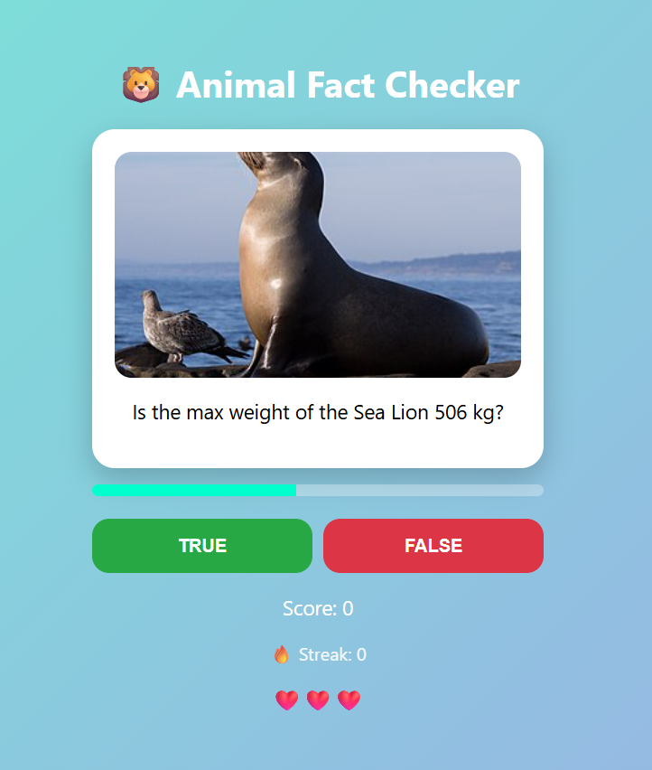

# 🐾 Animal Fact Checker

A web-based quiz game where players must determine whether animal facts are true or false. Test your knowledge of the animal kingdom across lifespan, weight, and diet — with a streak system and global leaderboard.

🔗 **[Play now](https://animal-fact-checker.onrender.com/)**



---

## 🎮 How it works

- Each round displays an animal photo and a fact (e.g. *"Is the max weight of the Sea Lion 506 kg?"*)
- Answer **True** or **False** before the timer runs out
- Build streaks to earn bonus points (×2 at 3, ×3 at 5)
- You have 3 lives — the game ends when you lose them all
- Top 10 scores are saved to the global leaderboard

---

## 🛠️ Tech Stack

| Layer | Technology |
|---|---|
| Backend | Python / Flask |
| Frontend | Vanilla JS, HTML, CSS |
| Database | PostgreSQL (Supabase) |
| Data source | [API Ninjas - Animals API](https://api-ninjas.com/api/animals) |
| Containerization | Docker |
| Hosting | Render |

---

## 🏗️ Architecture

```
animal-fact-checker/
│
├── app.py              # Flask routes & game logic
├── config.py           # App configuration
├── models.py           # SQLAlchemy models (Score)
├── animals.json        # Local cache of 100 animals from API Ninjas
├── Dockerfile
│
├── templates/
│   └── index.html
│
└── static/
    ├── css/
    │   ├── main.css
    │   ├── layout.css
    │   ├── components.css
    │   ├── screens.css
    │   ├── animations.css
    │   └── responsive.css
    └── js/
        ├── main.js     # Entry point
        ├── game.js     # Core game logic
        ├── api.js      # Backend calls
        └── ui.js       # DOM rendering
```

---

## 🚀 Run locally

### Prerequisites
- Python 3.11+
- Docker (optional)

### With Python

```bash
# Clone the repo
git clone https://github.com/AlexandrePernier/animal-fact-checker.git
cd animal-fact-checker

# Create and activate virtual environment
python -m venv venv
venv\Scripts\activate  # Windows
source venv/bin/activate  # macOS/Linux

# Install dependencies
pip install -r requirements.txt

# Create a .env file
cp .env.example .env
# Fill in your SECRET_KEY and DATABASE_URL

# Run
python app.py
```

### With Docker

```bash
docker build -t animal-fact-checker .
docker run -p 5000:5000 --env-file .env animal-fact-checker
```

App available at `http://localhost:5000`

---

## ⚙️ Environment variables

Create a `.env` file at the root:

```
SECRET_KEY=your_flask_secret_key
DATABASE_URL=postgresql://...
```

---

## 👤 Author

**AlexandrePernier** — [github.com/AlexandrePernier](https://github.com/AlexandrePernier)